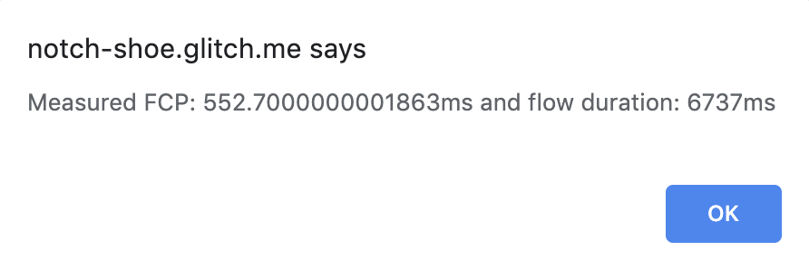
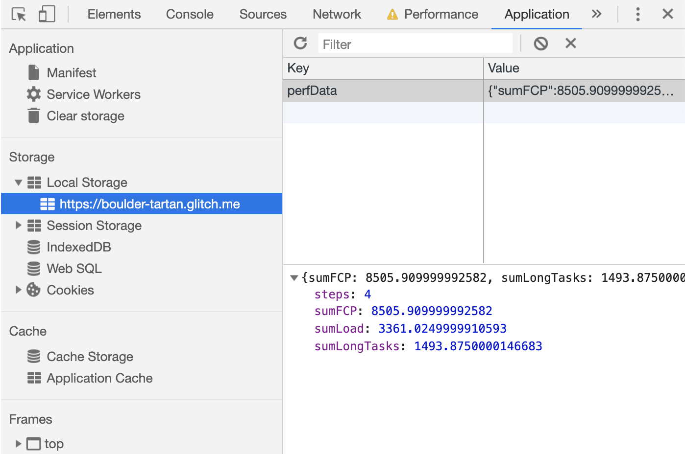
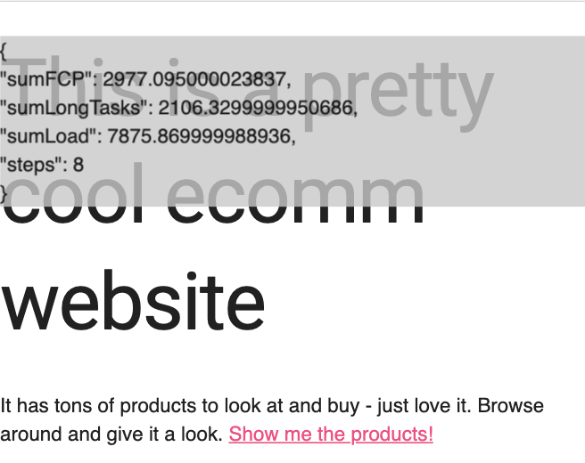

## Get familiar with the sample project

When you open the sample project in Glitch you'll find a very simple (and poorly
designed) e-commerce funnel from landing page, through product listing and
product page to basket and checkout. There are other files to be aware of:

- **labtest.html**: Used to trigger the lab test workflow.
- **perfoverlay.js**: Where you'll add field test code.
- **server.js**: Deliver files to users via an [Express](https://expressjs.com/)
  server.

## Get started


- Click the **App** button to start on the homepage of your e-commerce shop.
  Click through the flow  to see the different stages from landing to checkout.

You'll learn how to measure first load performance and time-to-action from
landing page to checkout in a lab test (through
[Puppeteer](https://github.com/GoogleChrome/puppeteer/blob/master/docs/api.md))
and field test.

## Measure page load speed

Measuring page load speed and page flow performance is a good task for the
headless Chrome Node API
[Puppeteer](https://github.com/GoogleChrome/puppeteer/blob/master/docs/api.md).
Via the API you can easily automate everything in Chrome, and even control most
Chrome DevTools functionality.

To get started, open `server.js`, and find the handler for the `labtest.json`
request:

```js
app.get('/labtest.json'…
```

This is where you'll find code to start Puppeteer, and where your lab test code
will go.

1. Open a new tab and navigate to `labtest.html`.
1. Click the button to trigger the response handler.

For now it will just give you a simple message,
stating that nothing is measured yet. Next you'll add in some simple Puppeteer
code to open your e-commerce shop homepage, and start measuring.

1. Replace the comment `TODO: add labtest via puppeteer` with these lines:

```js
await page.goto('https://ecomm-perf-codelab.glitch.me/index.html', { waitUntil: 'networkidle2'});
const fcp = await page.evaluate('window.performance.getEntriesByName(\"first-contentful-paint\")[0].startTime');
```

This loads the given URL in puppeteer until there are no more than two network
requests for at least 500ms
(['networkidle2'](https://github.com/GoogleChrome/puppeteer/blob/master/docs/api.md#pagegotourl-options)),
and then retrieves the FCP metric via injected JavaScript.

You can now return the FCP in the response text.

1. Update the `msg` variable in the handler so it looks like this:

```js/1/0
let msg = `Nothing measured yet!`;
let msg = `Measured FCP: ${fcp}ms`;
```

Now reload `labtest.html` and click the button. You should see the time taken to
[First Contentful Paint](https://developers.google.com/web/tools/lighthouse/audits/first-contentful-paint)
(FCP) of the first load in a window alert. If you feel that the FCP is still
quite fast, this is because you haven't throttled the network and CPU yet.

1. Insert this snippet before the line that calls `page.goto()`.

```js
//throttle network and CPU
const client = await page.target().createCDPSession();
await client.send('Network.enable');
await client.send('Network.emulateNetworkConditions', {
  'offline': false,
  'downloadThroughput': 1.5 * 1024 * 1024 / 8,
  'uploadThroughput': 750 * 1024 / 8,
  'latency': 40
});
await client.send('Emulation.setCPUThrottlingRate', { rate: 4 });
```

Now the FCP shown in the alert should have considerably worsened. You can add
many additional metrics with Pupeteeer. See
[Test website performance with Puppeteer](https://michaljanaszek.com/blog/test-website-performance-with-puppeteer)
for more detail.

## Measure page flow performance

It's particularly important on e-commerce sites to go beyond measuring
individual page performance in isolation. You also need to understand the time
it takes a user to go through a complete page flow, for example from landing to
checkout. In order to measure all the other pages of the funnel:

```js
const start = performance.now();
await page.goto('https://ecomm-perf-codelab.glitch.me/index.html', { waitUntil: 'networkidle2'});
const fcp = await page.evaluate('window.performance.getEntriesByName(\"first-contentful-paint\")[0].startTime');
await page.goto('https://ecomm-perf-codelab.glitch.me/index.html', { waitUntil: 'networkidle2'});
await page.goto('https://ecomm-perf-codelab.glitch.me/product_list.html', { waitUntil: 'networkidle2'});
await page.goto('https://ecomm-perf-codelab.glitch.me/product.html', { waitUntil: 'networkidle2'});
await page.goto('https://ecomm-perf-codelab.glitch.me/basket.html', { waitUntil: 'networkidle2'});
await page.goto('https://ecomm-perf-codelab.glitch.me/checkout.html', { waitUntil: 'networkidle2'});
const duration = parseInt(performance.now() - start);
let msg = `Measured FCP: ${fcp}ms and flow duration: ${duration}ms`;
```

The output should look like this:



Instead of measuring the sum of the full page loads, you can also sum up FCP if
you like, or whatever else you consider most meaningful.

Next you'll inject JavaScript into the pages loaded via Puppeteer to extract the
sum of
[long tasks](https://developer.mozilla.org/en-US/docs/Web/API/Long_Tasks_API): 
tasks that take 50 milliseconds or more.

1. Define a function to be executed for new documents to measure long tasks and
   track them on a global variable:

```js
page.evaluateOnNewDocument(function() {
  window.sumLongTasks = 0;
  const observer = new PerformanceObserver((list) => {
    for (const entry of list.getEntries()) {
      window.sumLongTasks += entry.duration;
    }
  });
  observer.observe({entryTypes: ['longtask']});
});
```

The value gathered can then after page load be retrieved like this:

```js
await page.evaluate(function() {return window.sumLongTasks;});
```

Now we can also sum these up across the whole flow, and again output it to the
page:


You can see and try the complete code in the
[final Glitch project](https://glitch.com/~ecomm-perf-codelab)
if you're interested. This section showed you how easy it is to launch
Puppeteer, throttle it down as needed, load pages, inject JavaScript and measure
performance. We strongly recommend that you build measurement scripts like this
for your most relevant time-to-actions and funnel flows, and execute and monitor
regularly.

## Build the field test

While lab data is always helpful, you need to collect the same metrics from real
usage, and potentially also make the data visible to stakeholders and decision
makers.
In your project, open the empty file  `perfoverlay.js`. You'll start by creating
a new
[PerformanceObserver](https://developers.google.com/web/updates/2016/06/performance-observer)
and tell it what to measure. For simplicity you'll stick to the same metrics you
collected in the lab test, but you can easily extend this for your own projects.
For now you'll listen for FCP, long tasks and load events. Add the following
code to the empty file `perfoverlay.js`:

```js
const observer = new PerformanceObserver((list) => {
  for (const entry of list.getEntries()) {
    if (entry.name === 'first-contentful-paint') {
      console.log(`FCP starts after ${entry.startTime}ms`);
    }
    if (entry.entryType === 'longtask') {
	    console.log(`LongTask took ${entry.duration} ms`);
    }
    if (entry.entryType === 'navigation') {
	    console.log(`Load event after ${entry.loadEventStart}ms`);
    }
  }
});
observer.observe({entryTypes: ['longtask', 'paint', 'navigation']});
```

Now reload the output page, and click around in the funnel. You will see on the
console data for  relevant metrics and events. You could now record these values
with your analytics platform for further analysis, but you also wanted to
measure page flow performance. You can save the metrics to `localStorage`, and
then sum up across page loads, to see the relevant time-to-action live. Add this
at the beginning of `perfoverlay.js`.

```js
let perfData;
const fromStorage = localStorage.getItem('perfData');
if (fromStorage) {
  perfData = JSON.parse(fromStorage);
}

if (!perfData) {
  perfData = {
    'sumFCP': 0,
    'sumLongTasks': 0,
    'sumLoad': 0,
    'steps': 0
  };
}
perfData.steps++;
```

Now you  adapt the observer code to sum these values when they happen, and save
the data to `localStorage`:

```js
const observer = new PerformanceObserver((list) => {
  for (const entry of list.getEntries()) {
    if (entry.name === 'first-contentful-paint') {
	    perfData.sumFCP += entry.startTime;
    }
    if (entry.entryType === 'longtask') {
      perfData.sumLongTasks += entry.duration;
    }
    if (entry.entryType === 'navigation') {
      perfData.sumLoad += entry.loadEventStart;
    }
    localStorage.setItem('perfData', JSON.stringify(perfData));
  }
});
observer.observe({entryTypes: ['longtask', 'paint', 'navigation']});
```

If you click now through the funnel from landing to checkout, you can see in
LocalStorage the metrics counting up:



This data  could be shared with your  analytics platform (e.g. via
[Google Analytics user timings](https://developers.google.com/analytics/devguides/collection/analyticsjs/user-timings)),
once the final action (such as payment) has been completed.

You can display current metrics in an overlay: see the complete code in the
[final Glitch project](https://glitch.com/~ecomm-perf-codelab). The output will
then look like this:



You could configure the  setup of your e-commerce site to show a performance
overlay on development and staging servers by default, or even hide it and only
bring it up on [device shake](http://qnimate.com/detect-shake-using-javascript/)
or similar.

Either way—you now know how to use  `PerformanceObserver` to measure landing
page performance, as well as flows and time-to-actions in the field for real
users.
